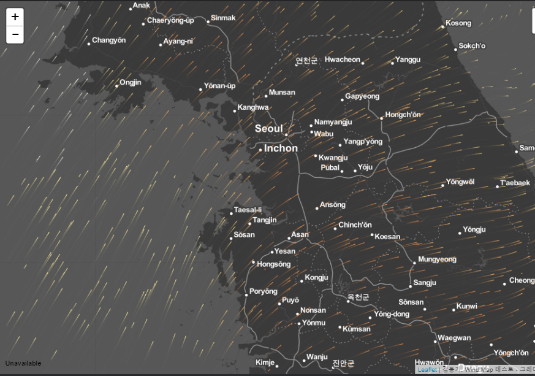
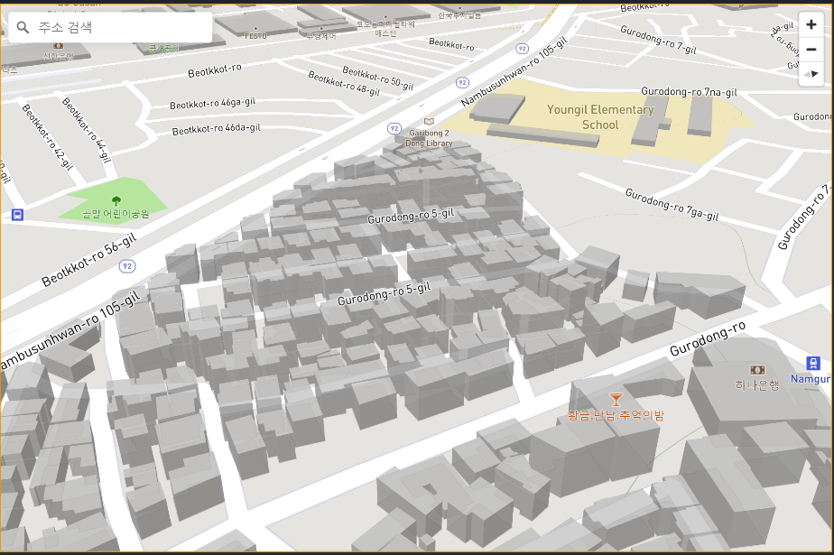
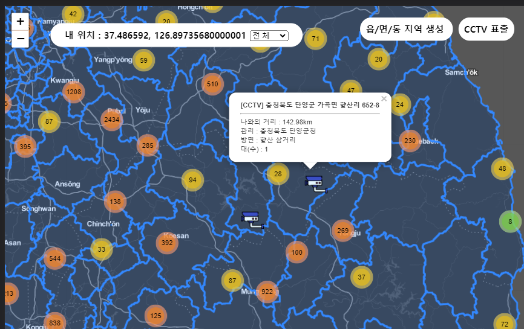
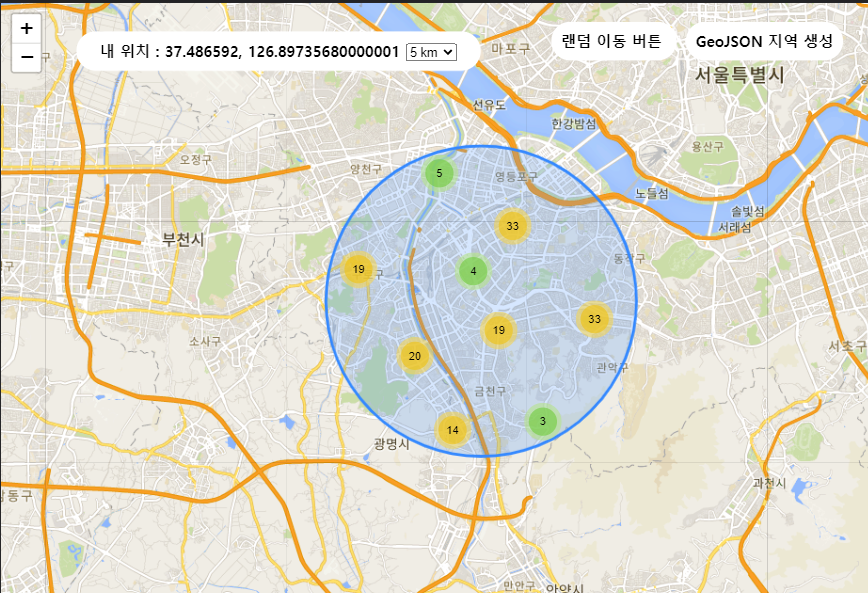

# Python Flask and LeafletJS

DongKi, Kim (Jayden)
---

### **Environment**  
+ Python v3.x
+ Flask
+ LeafletJS
+ WindJs
+ MapBox

#### Wind MAP (WindJS)

#### 3D MAP (MapBox)

#### CCTV in South Korea & GeoJSON area

#### Markers in Circles

